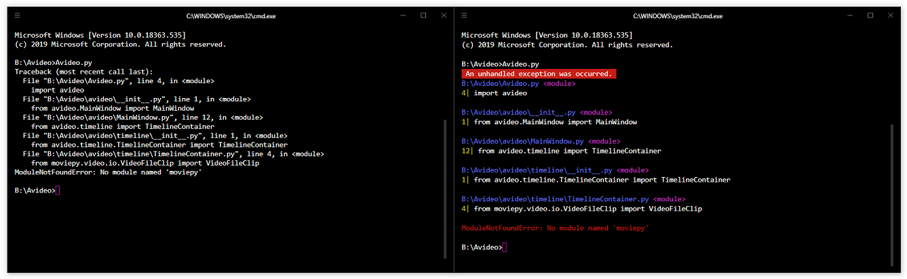

# Overview
Lancôme, The choice to fill your exception outputs with beauty.

Lancôme makes python outputs about exceptions prettier and clean.



# Usage
You just have to import and invoke `init` function of Lancôme. That's all!

```python
import lancome

lancome.init()
```

Also, you can initialize Lancôme with custom configure.

```python
import lancome

lancome.configure(
    use_color=True
).then(lancome.init())
```


# License
Licensed under the **MIT** License

> Copyright 2020 `Donghyeok Tak`
